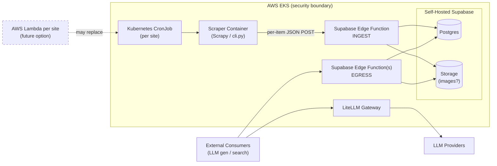

# Web Content Scraper — Target Architecture Specification

## 1. Project Overview (Target State)

**Purpose:** Capture the to-be architecture for the web scraper as it integrates with the content lake. This document is a **sibling** to `web_scraper_spec.md` (the current/as-is spec), not a replacement.

**Relationship to current spec:**
- The scraping engine described in `web_scraper_spec.md` (Scrapy-based, config-driven, per-site YAML, extractors/middlewares/pipelines) is **preserved**.
- What changes is the **deployment substrate**, the **output sink**, the **scheduling mechanism**, and the **downstream consumers** of the scraped content.

**Audience:** Downstream architecture documentation, platform/SRE for EKS deployment, Supabase/edge-function authors, and consumers building LLM-driven generation and search.

**Top-level shape:**
- Scraper runs as a container in **AWS EKS**, triggered by a per-site Kubernetes **CronJob**.
- Each scraped item is pushed (per-item, not batch) to a **Supabase Edge Function** that writes to a **self-hosted Supabase** content lake inside the same EKS environment.
- External consumers harvest content via separate **Supabase Edge Functions**.
- Any downstream LLM connectivity (by consumers, not the scraper) flows through **LiteLLM**.

---

## 2. Architecture at a Glance

**Legend:**
- **INGEST** edge function: write-path, called only by the scraper.
- **EGRESS** edge function(s): read-path, called only by external consumers.
- Dashed: future option (Lambda-per-site replacing the EKS CronJob trigger).
- EKS box: everything inside is co-located for security/data-residency. Supabase is **self-hosted**, not Supabase Cloud.

---

## 3. What Stays / Swapped / New

| Component | Status | Notes |
|---|---|---|
| `BaseSpider` and per-site spiders | **Stays** | Eight site spiders today: clm, griffith, iasa, iaum, iis, itl, rih, ti |
| Extractors (`jsonld`, `dom_fallback`, `image_extractor`) | **Stays** | Unchanged |
| Middlewares (`captcha`, `retry`) | **Stays** | Exponential-backoff retry behavior is also relevant to the new push pipeline |
| `ValidationPipeline` (slot 100) | **Stays** | Runs before push |
| `DedupPipeline` (slot 200) — logic | **Stays** | `_content_hash` and URL-keyed dedup semantics carry forward |
| `DedupPipeline` — storage backend | **Swapped** | Local SQLite (`state/{brand}_dedup.db`) → Supabase-backed dedup `[TBD]` |
| `JsonOutputPipeline` (slot 300) | **Swapped** | File writer → `EdgeFunctionPushPipeline` (HTTPS per-item POST) |
| Output destination | **Swapped** | Local filesystem (`output/*.json`) → Supabase via ingest edge function |
| Per-site YAML configs (`config/sites/*.yaml`) | **Stays** | Same shape; may grow fields for endpoint/auth config |
| `defaults.yaml` | **Stays** | Same shape; may grow ingest-related defaults |
| CLI (`cli.py`) | **Stays** | Container entrypoint = `python cli.py scrape --site $SITE_NAME` |
| Run mode | **Swapped** | Local CLI tool → containerized Scrapy job on EKS |
| Trigger | **New** | Kubernetes CronJob manifest per site (8) |
| Container image + Dockerfile | **New** | Built and published to a container registry `[TBD]` |
| Ingest edge function | **New** | Supabase Edge Function, validates + upserts into Postgres |
| Egress edge function(s) | **New** | Supabase Edge Function(s) serving consumers |
| LiteLLM gateway | **New** | Deployed in EKS; not called by the scraper, but defines the LLM boundary |
| Secrets/config delivery | **New** | Cluster-side secrets for ingest auth, DB creds, etc. `[TBD]` |
| Observability | **New** | Cluster-side logs/metrics/traces beyond the scraper's `LOG_LEVEL` |

---

## 4. Deployment Topology (AWS EKS)

### 4.1 Container Image
| Setting | Value |
|---|---|
| Base image | `[TBD — python:3.11-slim or similar]` |
| Entrypoint | `python cli.py scrape --site $SITE_NAME` |
| Build/registry | `[TBD]` |
| Image tagging strategy | `[TBD]` |

### 4.2 CronJob Topology
| Setting | Value |
|---|---|
| Pattern | One Kubernetes `CronJob` per site (8 today) |
| Schedule per site | `[TBD]` |
| Concurrency policy | `[TBD — Forbid recommended]` |
| Resource requests / limits | `[TBD]` |
| Namespace | `[TBD]` |
| ServiceAccount | `[TBD]` |
| Network policy (egress to ingest edge fn) | `[TBD]` |
| Restart / backoff on failure | `[TBD]` |

### 4.3 Future Option: Lambda Per Site
- Container-image Lambda triggered by EventBridge schedule.
- Trade-offs captured in §10.

---

## 5. Ingest Path: Edge Function Push Pipeline

Replaces `JsonOutputPipeline` at pipeline slot 300.

### 5.1 Pipeline Position
| Slot | Pipeline | Role |
|---|---|---|
| 100 | `ValidationPipeline` | Field validation (unchanged) |
| 200 | `DedupPipeline` | Compute `_content_hash`, suppress unchanged items |
| 300 | `EdgeFunctionPushPipeline` (**new**) | POST full item JSON to ingest edge function |

### 5.2 Endpoint Contract
| Aspect | Value |
|---|---|
| Method | `POST` |
| URL | `[TBD]` (Supabase Edge Function endpoint) |
| Headers | `Content-Type: application/json`, auth header `[TBD]` |
| Body | Full item dict (same fields as Content Model §3 of `web_scraper_spec.md`) |

### 5.3 Auth
`[TBD — options: service-role JWT, signed request with shared secret, mTLS]`

### 5.4 Retries & Backpressure
| Concern | Approach |
|---|---|
| Transient 5xx / network errors | Exponential backoff, max attempts `[TBD]` |
| 429 rate-limit | Respect `Retry-After`, backoff |
| Concurrency cap | Reuse Scrapy `CONCURRENT_REQUESTS` philosophy; per-pipeline cap `[TBD]` |
| In-process queue / buffering | `[TBD]` |
| Dead-letter behavior | `[TBD — drop, persist locally and retry next run, or external DLQ]` |

### 5.5 Idempotency
- Edge function performs **upsert** keyed on `source_url` (or `canonical_url`) + `_content_hash`.
- Same `_content_hash` for the same URL is a no-op at the lake.
- Lets the scraper retry safely without producing duplicates.

### 5.6 Failure Modes
| Mode | Behavior |
|---|---|
| Ingest endpoint unreachable | `[TBD]` |
| Auth rejected | Fail fast, log, exit non-zero `[TBD]` |
| Edge function returns validation error | Log, skip item `[TBD]` |
| Partial-batch failure within a run | `[TBD]` |

---

## 6. Content Lake (Self-Hosted Supabase on EKS)

> **Note:** Self-hosting Supabase inside EKS (rather than using Supabase Cloud) is an intentional choice for security and data-residency. This is unusual; trade-offs are captured in §10.

### 6.1 Components
| Component | Role |
|---|---|
| Postgres | Primary content store |
| PostgREST / GoTrue | Standard Supabase API/auth layer |
| Storage | Object storage (e.g., images) |
| Edge Functions runtime | Hosts ingest + egress functions |

### 6.2 Schema (TBD)
- Tables, column types, indexes: `[TBD]`
- Row-level security policies: `[TBD]`
- Mapping from scraper item fields (per Content Model §3 of `web_scraper_spec.md`) to lake columns: `[TBD]`

### 6.3 Image Storage
`[TBD — Supabase Storage vs. AWS S3 with Supabase pointer rows]`

### 6.4 Dedup State Migration
- Today: per-brand SQLite at `state/{brand}_dedup.db`.
- Target: dedup state lives in Supabase (single source of truth across multiple scraper pods/runs).
- Migration plan: `[TBD]`

---

## 7. Egress Path: Edge Functions for Consumers

Distinct from the ingest edge function. Same Edge Functions runtime, different role.

### 7.1 Purpose
Serve content to external consumers performing:
- LLM-driven content generation
- Search / retrieval

### 7.2 Endpoint Families (TBD)
| Family | Purpose | Status |
|---|---|---|
| List / query by filters | Discovery | `[TBD]` |
| Fetch by ID | Single-item retrieval | `[TBD]` |
| Search (full-text / vector) | Retrieval for LLM consumers | `[TBD]` |

### 7.3 Auth for External Consumers
`[TBD]`

### 7.4 Rate Limiting / Caching
`[TBD]`

---

## 8. LLM Boundary (LiteLLM)

- **The scraper does not call LLMs.** This section is for downstream architects so the full content-flow boundary is visible.
- **LiteLLM is the single proxy** for all downstream LLM calls made by consumers of the content lake.
- Deployment topology (central service in EKS vs. per-consumer sidecar): `[TBD]`
- Provider/model routing config: `[TBD]`

---

## 9. Cross-Cutting Concerns

### 9.1 Secrets Management
`[TBD — Kubernetes Secrets, AWS Secrets Manager, External Secrets Operator, etc.]`

### 9.2 Observability
- Scraper-internal logging via existing `LOG_LEVEL` setting carries forward.
- Cluster-side logs/metrics/traces stack: `[TBD]`
- Ingest edge function metrics (success rate, latency, payload size): `[TBD]`

### 9.3 CI/CD
- Container image build + publish: `[TBD]`
- Edge function deploy pipeline: `[TBD]`
- CronJob manifest deploy (GitOps?): `[TBD]`

### 9.4 Schema & Config Change Management
- Per-site YAML config change rollout: `[TBD]`
- Supabase schema migrations: `[TBD]`
- Edge function versioning: `[TBD]`

---

## 10. Trade-offs (Surface in the Spec)

### 10.1 EKS CronJob vs. AWS Lambda Per Site
| Dimension | EKS CronJob (current plan) | Lambda Per Site (future option) |
|---|---|---|
| Cold-start latency | Pod start (~seconds) | Cold start can affect first-run timing |
| Max runtime | Effectively unbounded | 15-minute hard cap |
| Ops surface | Shared EKS, same image | Per-site Lambda, possibly per-site image |
| Cost model | Cluster capacity | Per-invocation |
| Decision | **Start with CronJob, evaluate Lambda after Phase 3** | |

### 10.2 Self-Hosted Supabase vs. Supabase Cloud
| Dimension | Self-Hosted on EKS (chosen) | Supabase Cloud |
|---|---|---|
| Data residency | Stays in our AWS environment | Hosted by Supabase |
| Security posture | Inside our security boundary | Outside |
| Ops burden | We run it | Managed |
| Decision | **Self-hosted for security; accept ops burden** | |

### 10.3 Per-Item Push vs. Micro-Batch Push
| Dimension | Per-Item (chosen) | Micro-Batch |
|---|---|---|
| Latency to lake | Lowest | Higher |
| Edge-fn invocation count | Highest (cost) | Lower |
| Failure granularity | Per-item | Per-batch |
| Decision | **Per-item; revisit if invocation cost becomes a concern** | |

### 10.4 Dedup State Location
| Dimension | Local SQLite (today) | Supabase-backed (target) |
|---|---|---|
| Survives pod restart | No | Yes |
| Shared across runs / pods | No | Yes |
| Latency per check | Low | Network round-trip |
| Decision | **Move to Supabase**; resolve mechanics in `[TBD]` |

---

## 11. Open Questions / `[TBD]` Register

Consolidated triage list — decide which to resolve before drafting downstream architecture docs vs. defer:

| # | Topic | Section |
|---|---|---|
| 1 | Ingest edge function auth mechanism | 5.3 |
| 2 | Retry / backoff config for ingest pipeline | 5.4 |
| 3 | DLQ behavior for failed pushes | 5.4, 5.6 |
| 4 | Concurrency cap and buffering in push pipeline | 5.4 |
| 5 | Supabase table schema + indexes | 6.2 |
| 6 | Row-level security policies | 6.2 |
| 7 | Item-to-column mapping | 6.2 |
| 8 | Image storage (Supabase Storage vs. S3) | 6.3 |
| 9 | Dedup state migration plan from SQLite | 6.4 |
| 10 | Egress edge function endpoint design | 7.2 |
| 11 | Egress auth model for external consumers | 7.3 |
| 12 | Rate limiting / caching for egress | 7.4 |
| 13 | LiteLLM deployment topology | 8 |
| 14 | LiteLLM provider/model routing | 8 |
| 15 | Container base image and registry | 4.1 |
| 16 | Per-site CronJob schedules | 4.2 |
| 17 | Resource requests / limits | 4.2 |
| 18 | Namespace, ServiceAccount, network policy | 4.2 |
| 19 | Secrets management approach | 9.1 |
| 20 | Observability stack | 9.2 |
| 21 | CI/CD for image + edge functions + manifests | 9.3 |
| 22 | Supabase schema migration tooling | 9.4 |

---

## 12. Phased Migration Plan

Mirrors the phasing style of `web_scraper_spec.md` §9.

| Phase | Scope | Goal |
|---|---|---|
| Phase 1 | Containerize the scraper; deploy one site (e.g., `itl`) as an EKS CronJob; build the ingest edge function in dev | Prove the container + ingest path end-to-end |
| Phase 2 | Migrate dedup state from SQLite to Supabase; roll out CronJobs for all 8 sites | Production parity with current scraping coverage |
| Phase 3 | Stand up egress edge functions; deploy LiteLLM; onboard first consumer | Close the loop from ingest to LLM-driven consumption |
| Phase 4 | Evaluate Lambda-per-site migration; revisit per-item vs. micro-batch; harden observability and DLQ | Operate and optimize |

---
